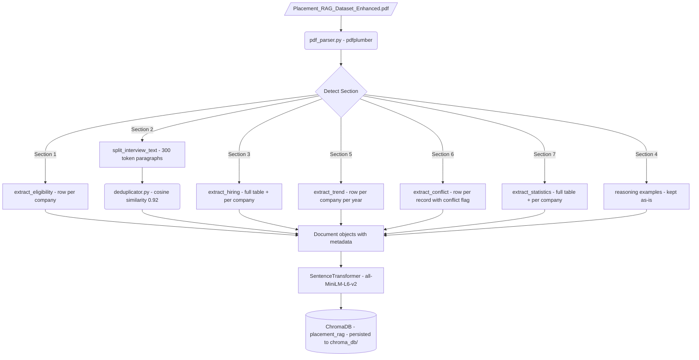
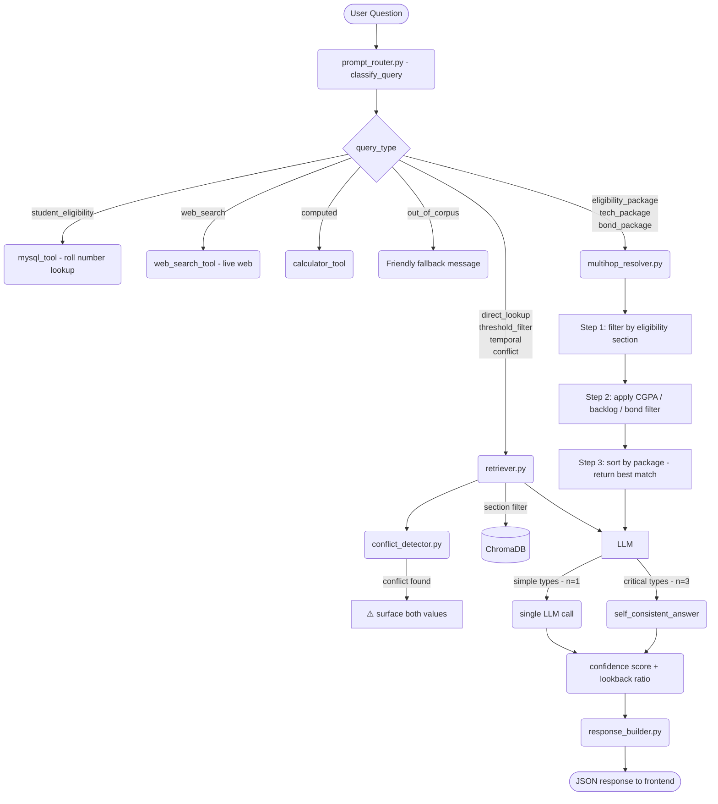
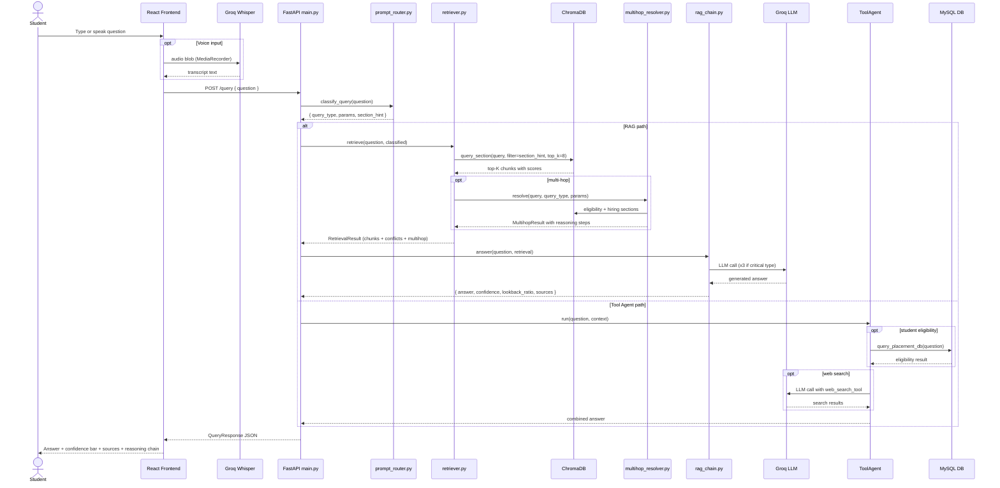
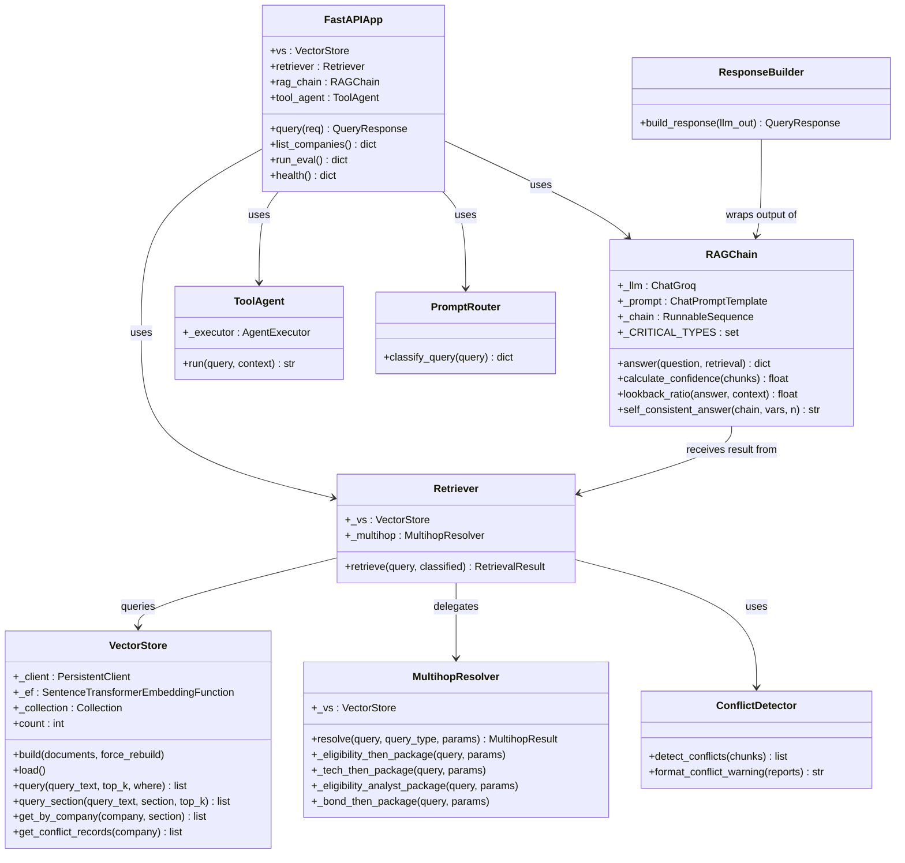

# 🎓 PlacementIQ — Placement Intelligence RAG System

PlacementIQ is an AI-powered placement advisor for SVECW students, built using Python, FastAPI, and React. You ask natural language questions about company eligibility, packages, interview rounds, and placement statistics, and the system retrieves accurate answers grounded strictly in the placement dataset. It does not guess or make up figures — every answer is cited with its source section and company.

---

## What This Project Does

PlacementIQ has five core capabilities that work together to answer placement queries accurately.

The first is **RAG-based Q&A**. Ask any placement question and the system retrieves the most relevant chunks from the ChromaDB vector store and generates a grounded answer using Groq LLaMA 3.3 70B. The LLM is strictly instructed never to use training-data knowledge — only the retrieved context.

The second is **Multi-hop reasoning**. For complex queries like "I have CGPA 7.5 and 0 backlogs — which company pays the most?" the system executes a structured reasoning chain: filter by eligibility, then sort by package, then surface the answer with numbered reasoning steps shown in the UI.

The third is **Conflict detection**. When the dataset contains both an official record and a portal record for the same company field, the system surfaces both values and warns the user to verify with the placement cell instead of silently returning one value.

The fourth is **Multi-tool agent**. For questions outside the PDF corpus — like CEO names, current stock prices, or company news — the system routes to a LangChain agent with three tools: web search (SerpAPI or DuckDuckGo), a MySQL database for student eligibility checks by roll number, and a calculator for arithmetic queries. A single query can invoke multiple tools.

The fifth is **Multilingual voice search**. Students can speak their query in English, Telugu, or Hindi using the Groq Whisper large-v3 model via the React frontend. The transcript is auto-sent to the backend after capture.

---

## UML Diagrams

### 1. System Architecture

Shows all layers — Student, React frontend, FastAPI backend, routing logic, RAG chain, ToolAgent, ChromaDB, and external APIs.

```mermaid
flowchart TD
    Student([Student]) -->|HTTP or Voice| React(React Frontend)
    React -->|POST /query| API(FastAPI - main.py)
    API -->|classify_query| Router(prompt_router.py)
    Router -->|query_type| Decision{Route Decision}

    Decision -->|rag / eligibility / multi-hop| RAG(RAGChain)
    Decision -->|web_search / student_eligibility / computed| Agent(ToolAgent)
    Decision -->|out_of_corpus| Fallback(Fallback Response)

    RAG -->|retrieve| Retriever(retriever.py)
    Retriever -->|semantic search| Chroma[(ChromaDB - placement_rag)]
    Retriever -->|multi-hop chain| MultiHop(multihop_resolver.py)
    Retriever -->|conflict check| Conflict(conflict_detector.py)
    Retriever --> RAGChain2(rag_chain.py)
    RAGChain2 -->|self-consistency x3| Groq[/Groq LLaMA 3.3 70B/]

    Agent -->|web_search_tool| Web[DuckDuckGo / SerpAPI]
    Agent -->|mysql_tool| MySQL[(MySQL - placements_db)]
    Agent -->|calculator_tool| Calc[Math Eval]
    Agent -->|LLM| Groq

    Groq --> Response(response_builder.py)
    Response --> API
    API --> React
    React -->|Voice Input| Whisper[/Groq Whisper large-v3/]
    Whisper --> React
```



---

### 2. Document Ingestion Pipeline

Shows how the placement PDF is parsed by section, chunked with section-specific strategies, deduplicated, and persisted to ChromaDB.



---

### 3. Query Routing and RAG Flow

Shows how a user question flows from classification through retrieval, conflict detection, multi-hop resolution, self-consistency, and final answer generation.



---

### 4. Sequence Diagram

Shows the full order of interactions between all components from a student query to the final answer.



---

### 5. Class Diagram

Shows all classes, their attributes, methods, and relationships.



---

## How It Works

When you send a question, the FastAPI backend passes it to `prompt_router.py`, which classifies the query type and extracts numeric parameters like CGPA, backlog count, or package threshold.

If the query is a standard RAG query, the retriever fetches the top-8 chunks from ChromaDB filtered by section metadata, runs the conflict detector to check for discrepancies between official and portal records, and passes everything to `rag_chain.py`. For critical query types like eligibility filtering, the LLM is called three times and the most consistent answer is returned. A confidence score (based on ChromaDB cosine distances) and a lookback ratio (measuring how grounded the answer is in the context) are computed and shown to the user.

If the query is multi-hop — such as "which company pays most for CGPA 7.5 with no backlogs" — the `multihop_resolver.py` runs a structured chain: retrieve all eligibility chunks, filter by CGPA and backlog constraints, sort by package, and return the winner with numbered reasoning steps shown in the UI.

If the query requires live external data — CEO names, stock prices, or company news — it is routed to the ToolAgent. If it involves a student's roll number or personal CGPA, it routes to the MySQL tool. Both tools can be used in a single query.

---

## Technologies Used

- Python 3.11
- FastAPI and Uvicorn for the API server
- LangChain for the RAG chain and ToolAgent orchestration
- Groq API with LLaMA 3.3 70B for text generation
- Groq Whisper large-v3-turbo for multilingual voice transcription
- ChromaDB for vector storage and metadata-filtered retrieval
- HuggingFace Sentence Transformers (`all-MiniLM-L6-v2`) for embeddings
- pdfplumber for accurate PDF parsing with table and image extraction
- MySQL for student eligibility and placement statistics database
- DuckDuckGo Search and SerpAPI for live web search
- React with Vite and Tailwind CSS for the frontend
- RAGAS for RAG pipeline evaluation

---

## Project Structure

The `backend/` folder contains all server-side logic.

`main.py` is the FastAPI entry point. It defines the `/query`, `/companies`, `/stats`, `/eval`, and `/health` endpoints and initialises all singletons at startup.

`config.py` holds all settings — model names, chunk strategies, ChromaDB paths, section metadata, out-of-corpus patterns, and database credentials.

The `agent/` folder contains the LangChain layer. `prompt_router.py` classifies every incoming query and extracts params. `rag_chain.py` builds the grounded prompt, calls the LLM with self-consistency for critical types, and computes confidence and lookback ratio. `tool_agent.py` runs the multi-tool agent for web, database, and calculator queries. `tools.py` defines all five StructuredTools: calculator, corpus boundary check, package-CGPA ratio, web search, and MySQL.

The `ingestion/` folder handles PDF processing. `pdf_parser.py` extracts text, tables, and images per page using pdfplumber. `chunker.py` orchestrates all chunking strategies: row-per-company for eligibility, paragraph split for interview text, full table for hiring and statistics, row-per-record for conflicts, and row-per-year for trends. `deduplicator.py` removes near-duplicate interview chunks using cosine similarity. `table_extractor.py` converts raw table rows into natural language passages with structured metadata. `chart_captioner.py` captions bar chart images using Groq's vision model.

The `retrieval/` folder handles querying. `vector_store.py` wraps ChromaDB with section-filtered search and metadata helpers. `retriever.py` dispatches to multi-hop, conflict, section-specific, or general retrieval based on the classified query. `multihop_resolver.py` executes four structured chains: eligibility-then-package, tech-then-package, eligibility-analyst-package, and bond-then-package. `conflict_detector.py` scans retrieved chunks for official-vs-portal discrepancies and returns warning messages.

The `response/` folder handles response assembly. `response_builder.py` wraps the LLM output into the `QueryResponse` schema. `fallback_handler.py` generates friendly out-of-corpus messages.

The `evaluation/` folder contains `eval_runner.py` which runs 30 evaluation queries and scores routing accuracy, OOC detection, answer correctness, and conflict detection. `eval_queries.py` holds all 30 test cases.

The `frontend/` folder is a React + Vite app. `ChatPanel.jsx` is the main chat interface with confidence bars, conflict badges, reasoning chain display, and source citation toggles. `VoiceSearch.jsx` records audio with the MediaRecorder API and sends it to Groq Whisper for transcription in English, Telugu, or Hindi. `CompanyCard.jsx`, `EligibilityFilter.jsx`, `HiringChart.jsx`, `ConflictBadge.jsx`, and `EvalPanel.jsx` are supporting UI components.

---

## How to Run the Project

**Backend**

Clone the repository and go into the backend folder.

```bash
git clone https://github.com/konduri-lakshmi-prasanna/placements-RAG.git
cd placements-RAG/backend
```

Create a virtual environment and activate it.

```bash
python -m venv .venv
source .venv/bin/activate
```

Install the Python packages.

```bash
pip install -r requirements.txt
```

Create a `.env` file in the `backend/` folder and add your credentials.

```
GROQ_API_KEY=your_groq_key_here
SERPAPI_KEY=your_serpapi_key_here        # optional, falls back to DuckDuckGo
DB_HOST=localhost                        # optional, for MySQL tool
DB_USER=root
DB_PASSWORD=your_password
DB_NAME=placements_db
```

Set up the MySQL database (optional, needed for student eligibility tool).

```bash
mysql -u root -p < db_setup.sql
```

Run the API server.

```bash
python main.py
```

The API will be available at `http://localhost:8000`. The vector store is built automatically on first run from the PDF in `data/`.

**Frontend**

Go into the frontend folder and install dependencies.

```bash
cd ../frontend
npm install
```

Create a `.env` file in the `frontend/` folder.

```
VITE_GROQ_API_KEY=your_groq_key_here
```

Start the development server.

```bash
npm run dev
```

Then open `http://localhost:5173` in your browser.

---

## API Endpoints

| Method | Endpoint | Description |
|---|---|---|
| POST | `/query` | Main RAG query endpoint |
| GET | `/companies` | List all companies with eligibility data |
| GET | `/stats` | Vector store info and model details |
| POST | `/eval` | Run the 30-query evaluation suite |
| GET | `/health` | Health check |

---

## Example Queries

```
"What is Amazon's CGPA requirement and how many backlogs are allowed?"
"I have CGPA 7.5 and 0 backlogs — which company pays the highest?"
"Which companies accept 2 backlogs?"
"Is there any conflict in TCS's CGPA cutoff between official and portal?"
"What Python-focused companies have the best packages?"
"Is roll no 21A91A0501 eligible for TCS and who is the CEO?"
"What is TCS's stock price today?"
"Which companies offer no bond and more than 40 LPA?"
```

---

## Evaluation

The project includes an evaluation suite in `evaluation/eval_runner.py` that tests 30 queries and measures four things: routing accuracy, out-of-corpus detection accuracy, answer correctness using keyword matching, and conflict detection rate.

To run the evaluation, start the server, then call the eval endpoint.

```bash
curl -X POST http://localhost:8000/eval
```

Results are returned as JSON and saved to `logs/eval_results.json`.

---

## Environment Variables

| Variable | Description |
|---|---|
| `GROQ_API_KEY` | Groq API key for LLM and Whisper |
| `SERPAPI_KEY` | SerpAPI key for web search (optional) |
| `DB_HOST` | MySQL host for student eligibility tool (optional) |
| `DB_USER` | MySQL username |
| `DB_PASSWORD` | MySQL password |
| `DB_NAME` | MySQL database name |
| `VITE_GROQ_API_KEY` | Groq key for frontend Whisper voice search |

---

## What I Learned

This project helped me understand how to build a production-grade RAG system with hallucination mitigations. I learned how to design section-aware chunking strategies for structured PDF data, how to implement multi-hop retrieval chains for complex eligibility queries, how to detect data conflicts and surface warnings instead of silently returning wrong values, how to combine RAG with a multi-tool LangChain agent for hybrid queries, how to integrate Groq Whisper for multilingual voice input, and how to evaluate a RAG pipeline using routing accuracy and answer correctness metrics.

---

## Deployment

The backend is configured for Railway deployment (`railway.json`, `Procfile`). The frontend is deployed on Vercel at [placements-pearl.vercel.app](https://placements-pearl.vercel.app).

---

## Author

Built by Prasanna Konduri for RAG-ATHON 2024 at SVECW, exploring LangChain, ChromaDB, multi-hop RAG, hallucination mitigation, and LLM-powered placement intelligence.